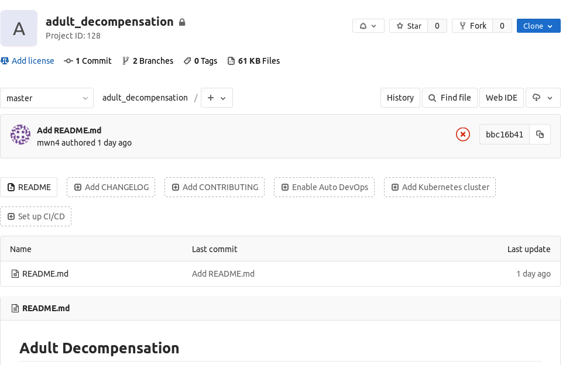
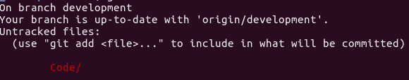
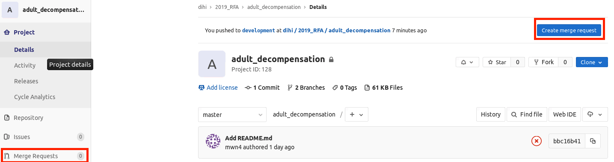
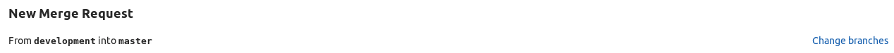
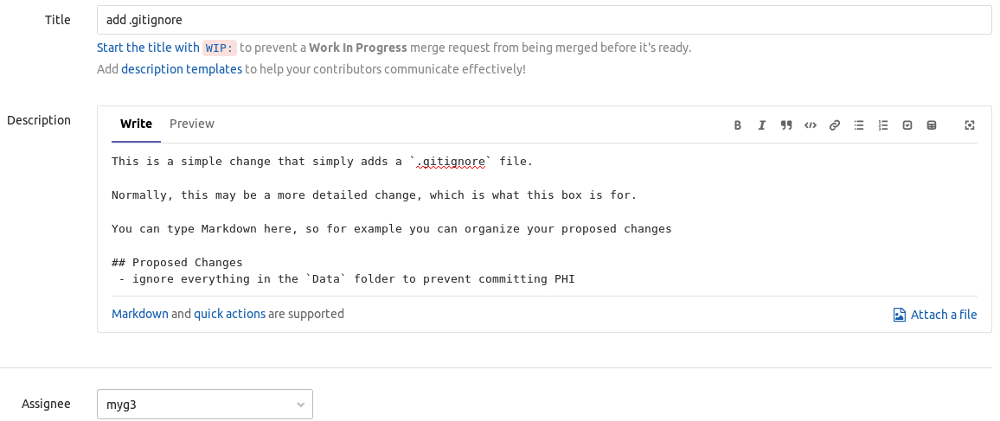
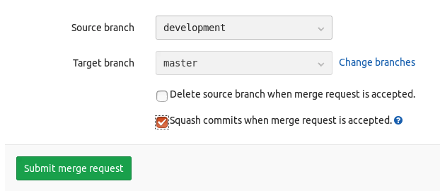
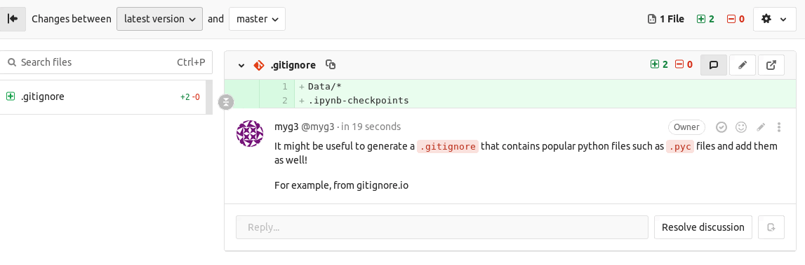
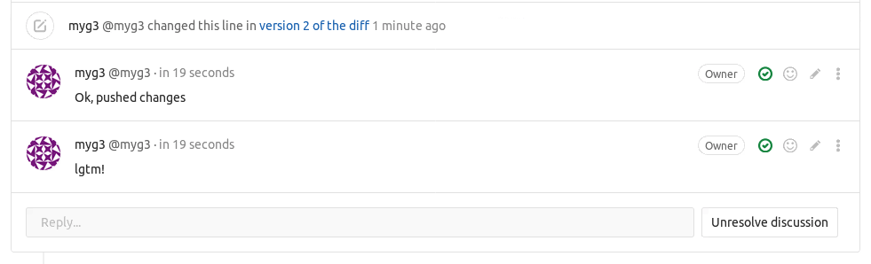
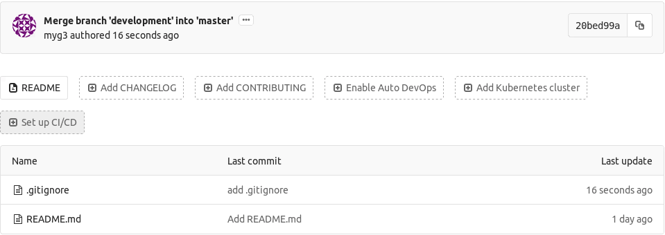

# Data Science Code Reviews / Development

The following describes how to request a Data Science code review, especially when working in [PACE](https://pace.ori.duke.edu/). 

## When should I request a Code Review?

Usually, we will discuss when a project meets a milestone where a code review will be needed. In general, however, we usually will do a code review after the following steps:

1. Cohort generation
2. Feature Engineering
3. Modeling
4. Evaluation

Notably, a missing portion here in the Data Science process is Exploratory Data Analysis, which we often discuss outside of the context of coding (often with clinicians, etc.). When you feel that any of these steps are complete, it may be time to request a code review. If you are not sure if it is appropriate, you can contact Michael Gao or Marshall Nichols to ask for guidance.

## How do I develop in PACE?

Most of the time, your project should have a gitlab repository that we create. For the sake of example, we will use the `Adult Decompensation` project gitlab. 

The initial repository may have a relatively simple `Master` branch, which is the branch that we want to keep with clean code that we know is functional. 

Your project folder in PACE should automatically be a git repository. When you type `git status`, you should see the following:

Next, you can commit your changes as usual and follow the Regular Use guidelines at the [Git usage guide](Git.md). 

## How do I submit a Code Review request?

The first thing you should do is to check out the [Data Science Code Review Checklist](DataScienceCodeReview.md). These are meant to be a series of quick checks to ensure that your code is ready to be reviewed. 
Once you have code that you feel is ready to review, make sure you push the changes to the development branch. Once you do so, you can navigate to the repository at `pacegitlab.dhe.duke.edu`.

Once there, you can submit a Merge Request (equivalently a Pull Request on Github), which will initiate the code review process. You can navigate to the merge request section by clicking on the following places:

Make sure that your merge requesting is merging the `development` branch into the `master` branch. If it does not, you will need to change it.

Fill out the merge request and be as detailed as you feel is necessary. It is better to give the reviewer as much context as possible so that it is easy to review the code being submitted. For the Assign box, you can assign to Michael Gao (myg3) or Marshall Nichols (mwn4).

After you have finished this, make sure you check the following box and click submit!

## What happens next?

After you have submitted a request for review, please let someone from DIHI know that you have submitted the request (since we cannot receive email alerts from within PACE).

Next, we will review your code and make appropriate suggestions. This is a great opportunity for both parties to learn and to provide feedback! Let's take a look at an example:

If you ignore that I'm reviewing my own code for a second, you'll see that I have commented in specific places in the code and that further work needs to be done. 
Next, it is your responsiblity to address the issues. Let's take the suggestion and make a new commit!

Your reviewer will see the changes you've made. Hopefully, all the issues have been addressed and you can resolve the discussion. Once this is done and your code has been fully approved, the merge request and Code Review will be marked as complete and merged into the master branch.

You should see the changes you've made propagated to the Master branch!

## Questions?

Reach out to Michael Gao or Marshall Nichols on slack for further clarifications on the process. If you have any general feedback, feel free to let us know! We are always looking to improve.
